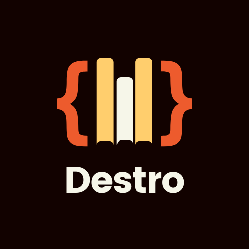

[](https://classroom.github.com/online_ide?assignment_repo_id=7943950&assignment_repo_type=AssignmentRepo)

<div id="top"></div>
<!--
*** Thanks for checking out the Best-README-Template. If you have a suggestion
*** that would make this better, please fork the repo and create a pull request
*** or simply open an issue with the tag "enhancement".
*** Don't forget to give the project a star!
*** Thanks again! Now go create something AMAZING! :D
-->

<!-- PROJECT SHIELDS -->
<!--
*** I'm using markdown "reference style" links for readability.
*** Reference links are enclosed in brackets [ ] instead of parentheses ( ).
*** See the bottom of this document for the declaration of the reference variables
*** for contributors-url, forks-url, etc. This is an optional, concise syntax you may use.
*** https://www.markdownguide.org/basic-syntax/#reference-style-links
-->
[![Made With][made-with-shield]][made-with-url]
[![Contributors][contributors-shield]][contributors-url]
[![Forks][forks-shield]][forks-url]
[![Stargazers][stars-shield]][stars-url]
[![MIT License][license-shield]][license-url]
[![LinkedIn][linkedin-shield]][linkedin-url]

<!-- PROJECT LOGO -->
<br />
<div align="center">
  <a href="https://github.com/dyte-submissions/dyte-vit-2022-kanitmann">
    
  </a>

<h3 align="center">Destro -  A Distribution Management CLI Tool</h3>

  <p aligh="left">
    A lot of our microservices are written in Node.js and making sure that the dependencies for these services are up to date can be a bit of a hassle. This CLI solves this Problem.

  Given a list of Github repositories, assuming all of them are node js projects with a `package.json` and `package-lock.json` in the root, and the name and version of a dependency, we want to give the current version of that dependency and tell if the version is greater than or equal to the version specified or not.

  For Example, considering we feed them a list of repositories in a CSV like this:

| name                    | repo                                             |
|-------------------------|--------------------------------------------------|
| dyte-react-sample-app   | https://github.com/dyte-in/react-sample-app/     |
| dyte-js-sample-app      | https://github.com/dyte-in/javascript-sample-app |
| dyte-sample-app-backend | https://github.com/dyte-in/backend-sample-app    |

<br />
<a href="https://github.com/dyte-submissions/dyte-vit-2022-kanitmann"><strong>Explore the docs »</strong></a>
<br />
<br />
<a href="https://github.com/dyte-submissions/dyte-vit-2022-kanitmann">View Demo</a>
·
<a href="https://github.com/dyte-submissions/dyte-vit-2022-kanitmann/issues">Report Bug</a>
·
<a href="https://github.com/dyte-submissions/dyte-vit-2022-kanitmann/issues">Request Feature</a>

  </p>
</div>

<!-- TABLE OF CONTENTS -->
<details>
  <summary>Table of Contents</summary>
  <ol>
    <li>
      <a href="#about-the-project">About The Project</a>
      <ul>
        <li><a href="#built-with">Built With</a></li>
      </ul>
    </li>
    <li>
      <a href="#getting-started">Getting Started</a>
      <ul>
        <li><a href="#prerequisites">Prerequisites</a></li>
        <li><a href="#installation">Installation</a></li>
      </ul>
    </li>
    <li><a href="#usage">Usage</a></li>
    <li><a href="#roadmap">Roadmap</a></li>
    <li><a href="#contributing">Contributing</a></li>
    <li><a href="#license">License</a></li>
    <li><a href="#contact">Contact</a></li>
    <li><a href="#acknowledgments">Acknowledgments</a></li>
  </ol>
</details>

<!-- ABOUT THE PROJECT -->

## About The Project

[![Destro][product-screenshot]]()


<p align="right">(<a href="#top">back to top</a>)</p>

### Built With

- [Nodejs](https://nextjs.org/)

<p align="right">(<a href="#top">back to top</a>)</p>

<!-- GETTING STARTED -->

## Getting Started

This is an example of how you may give instructions on setting up your project locally.
To get a local copy up and running follow these simple example steps.

### Prerequisites

This is an example of how to list things you need to use the software and how to install them.

- npm
  ```sh
  npm install npm@latest -g
  ```

### Installation

1. Clone the repo
   ```sh
   git clone https://github.com/dyte-submissions/dyte-vit-2022-kanitmann.git
   ```
2. Install NPM packages
   ```sh
   npm install
   ```
3. Globally install the to use CLI tool
   ```sh
   npm install -g .
   ```
4. Run the Destro tool
    ```sh
    destro --help
    ```

<p align="right">(<a href="#top">back to top</a>)</p>


## Roadmap

- [x] Implement CLI commands
- [x] Read CSV file
- [ ] Compare Versions
  - [x] Read Version from CLI
  - [x] Fetch Versions from URL
  - [ ] Compare and Write results in CSV
- [ ] Raise Pull Request

See the [open issues](https://github.com/dyte-submissions/dyte-vit-2022-kanitmann/issues) for a full list of proposed features (and known issues).

<p align="right">(<a href="#top">back to top</a>)</p>

<!-- CONTRIBUTING -->

## Contributing

Contributions are what make the open source community such an amazing place to learn, inspire, and create. Any contributions you make are **greatly appreciated**.

If you have a suggestion that would make this better, please fork the repo and create a pull request. You can also simply open an issue with the tag "enhancement".
Don't forget to give the project a star! Thanks again!

1. Fork the Project
2. Create your Feature Branch (`git checkout -b feature/AmazingFeature`)
3. Commit your Changes (`git commit -m 'Add some AmazingFeature'`)
4. Push to the Branch (`git push origin feature/AmazingFeature`)
5. Open a Pull Request

<p align="right">(<a href="#top">back to top</a>)</p>

<!-- LICENSE -->

## License

Distributed under the GNU GPL-3.0 License. See `LICENSE.txt` for more information.

<p align="right">(<a href="#top">back to top</a>)</p>

<!-- CONTACT -->

## Contact

Kanit Mann -- mannkanit@gmail.com

Project Link: [https://github.com/dyte-submissions/dyte-vit-2022-kanitmann/](https://github.com/dyte-submissions/dyte-vit-2022-kanitmann/)

<p align="right">(<a href="#top">back to top</a>)</p>

<!-- ACKNOWLEDGMENTS -->

## Acknowledgments

- [Kanit Mann](https://github.com/kanitmann)

<p align="right">(<a href="#top">back to top</a>)</p>

<!-- MARKDOWN LINKS & IMAGES -->
<!-- https://www.markdownguide.org/basic-syntax/#reference-style-links -->

[contributors-shield]: https://img.shields.io/github/contributors/kanitmann/Metasploit_Exploit.svg?style=for-the-badge
[contributors-url]: https://github.com/kanitmann/Metasploit_Exploit/graphs/contributors
[forks-shield]: https://img.shields.io/github/forks/kanitmann/Metasploit_Exploit.svg?style=for-the-badge
[forks-url]: https://github.com/kanitmann/Metasploit_Exploit/network/members
[stars-shield]: https://img.shields.io/github/stars/kanitmann/Metasploit_Exploit.svg?style=for-the-badge
[stars-url]: https://github.com/kanitmann/Metasploit_Exploit/stargazers
[license-shield]: https://img.shields.io/github/license/kanitmann/Muses-Mini-frontend?style=for-the-badge&logo=appveyor
[license-url]: https://github.com/kanitmann/Muses-Mini-frontend/blob/master/LICENSE.txt
[made-with-shield]: https://img.shields.io/github/languages/top/kanitmann/ocrApiTesting?style=for-the-badge
[made-with-url]: https://shields.io/github/languages/top/kanitmann/ocrApiTesting.svg?style-for-the-badge
[linkedin-shield]: https://img.shields.io/badge/-LinkedIn-black.svg?style=for-the-badge&logo=linkedin&colorB=555
[linkedin-url]: https://linkedin.com/in/kanitmann
[product-screenshot]: images/Screenshot.png
